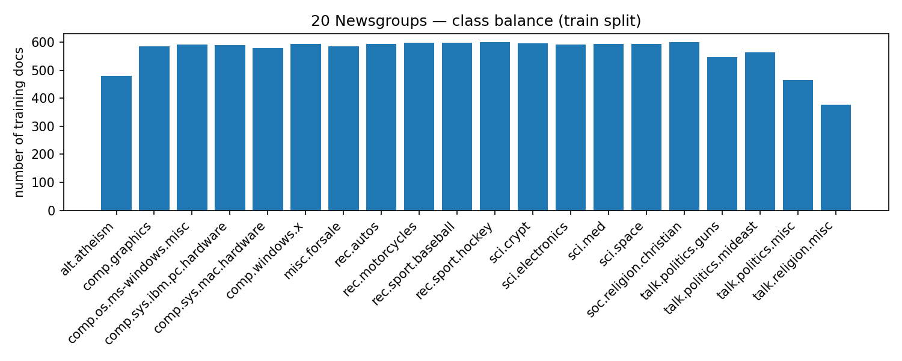
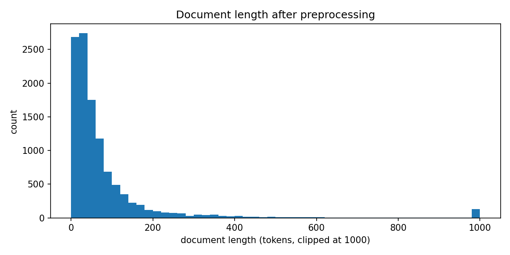
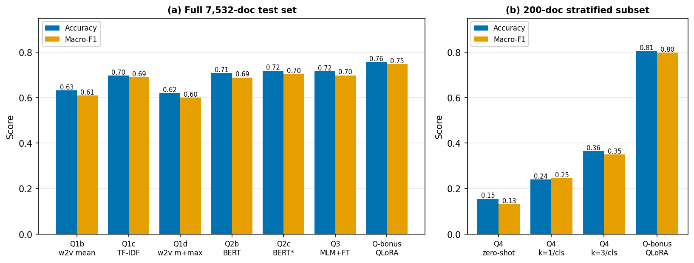
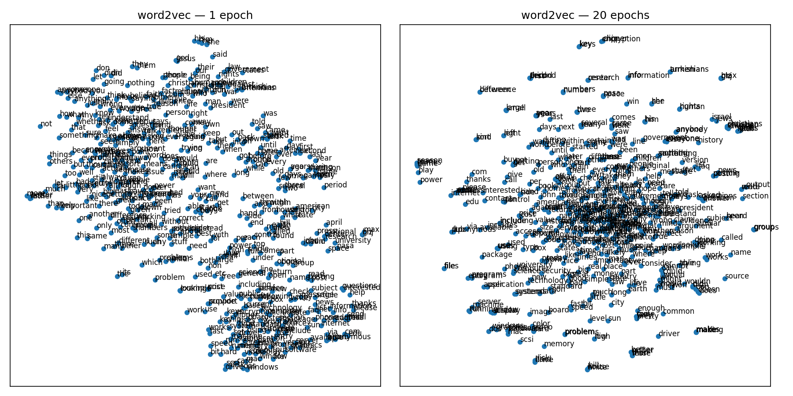
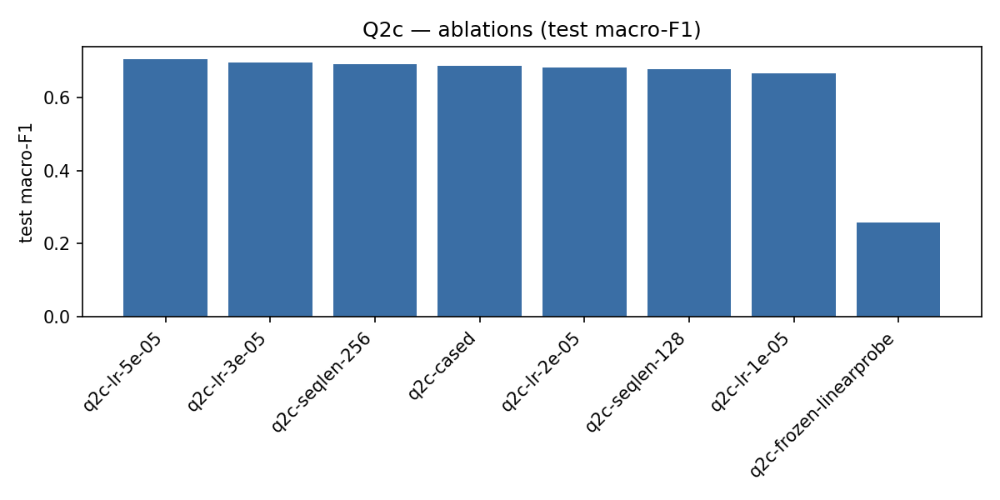
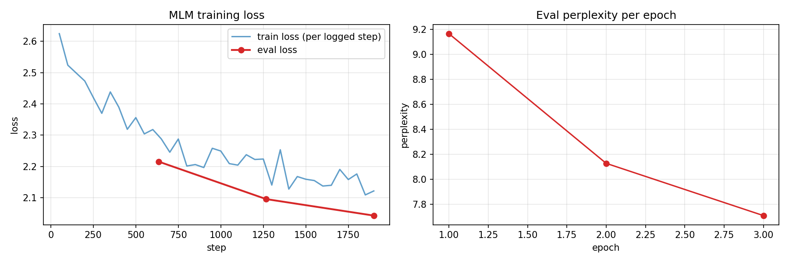
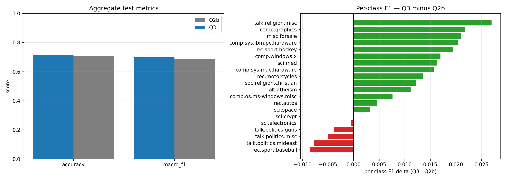
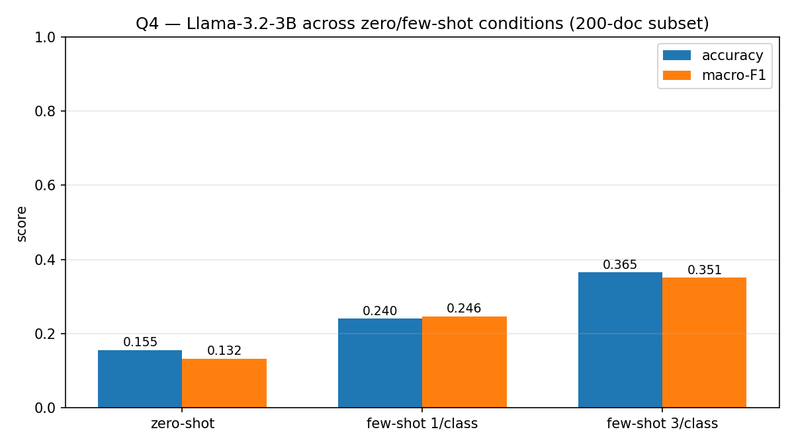
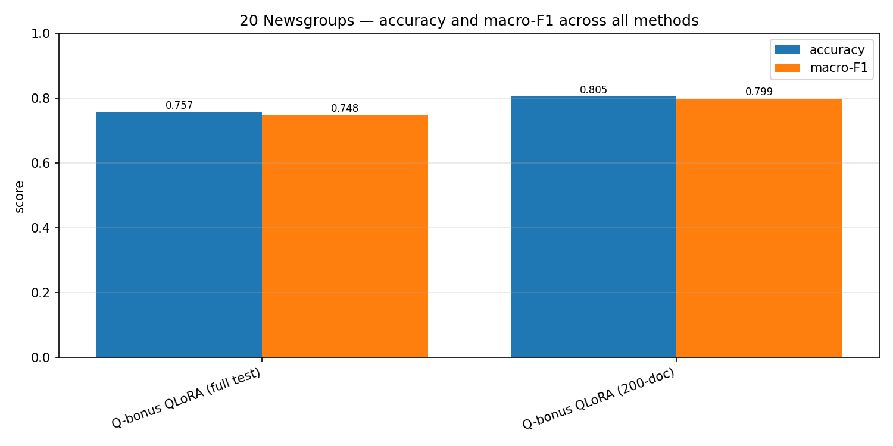
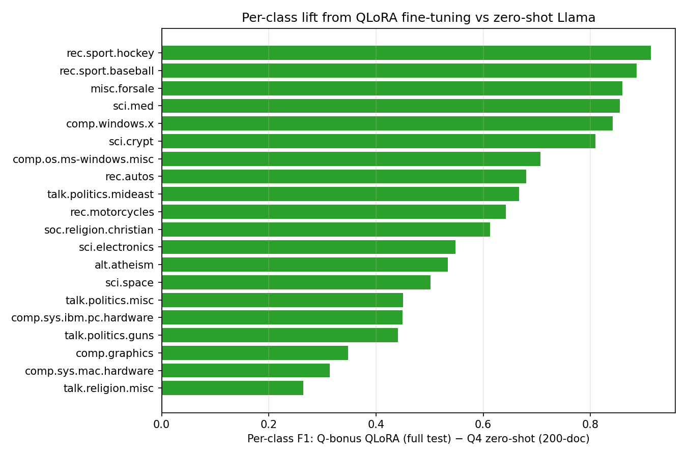

# NALAPRO — A Comparative Study of Text-Classification Paradigms on 20 Newsgroups

> HSLU MSc **NALAPRO** (Natural Language Processing) graded project.
> A single, reproducible code base that walks the full arc of modern text
> classification on the **20 Newsgroups** corpus — from a hand-rolled two-layer
> perceptron over classical embeddings, through BERT fine-tuning and in-domain
> masked-language-model pretraining, to zero/few-shot prompting and QLoRA
> fine-tuning of Llama-3.

**Author:** Dan Waititu Wanjohi · **Module:** NALAPRO (Hochschule Luzern) ·
**Submission deadline:** EOD 2026-06-06

---

## 🔗 Quick links

| Resource | Where |
| --- | --- |
| 📦 **GitHub repository** | <https://github.com/DanYT2/NLP_Project> |
| 📊 **Weights & Biases project** (all runs, all questions) | <https://wandb.ai/danwwaititu-hochschule-luzern/hslu-nalapro?nw=nwuserdanwwaititu> |
| 📑 **Project documentation** (root copy of the report) | [`NALAPRO_Project_documentation.pdf`](NALAPRO_Project_documentation.pdf) |
| 🖥️ **Presentation slides** (static) | [`NLP_Presentation.pdf`](NLP_Presentation.pdf) |
| 🎛️ **Presentation — interactive deck** | [`presentation/index.html`](presentation/index.html) — open in a browser |
| 📜 **Assignment spec** | [`project_description/NALAPRO Project.pdf`](project_description/NALAPRO%20Project.pdf) |

> **Documentation in the repo root.** The full project documentation /
> scientific report is available in the repository root as
> [`NALAPRO_Project_documentation.pdf`](NALAPRO_Project_documentation.pdf). The
> presentation slides are in [`NLP_Presentation.pdf`](NLP_Presentation.pdf) — but
> for a **more interactive experience** (hover tooltips, accuracy/macro-F1
> toggles, keyboard navigation) open [`presentation/index.html`](presentation/index.html)
> directly in any browser; it needs no server and runs fully offline.

---

## Table of contents

1. [Project overview](#1-project-overview)
2. [The dataset](#2-the-dataset)
3. [Headline results](#3-headline-results)
4. [The five experiments](#4-the-five-experiments)
   - [Q1 — Two-layer MLP](#q1--two-layer-mlp-classical-representations)
   - [Q2 — BERT fine-tuning](#q2--bert-fine-tuning)
   - [Q3 — MLM pretraining → fine-tune](#q3--in-domain-mlm-pretraining--fine-tune)
   - [Q4 — Llama-3 zero/few-shot](#q4--llama-3-zero--few-shot)
   - [Q-bonus — QLoRA fine-tune](#q-bonus--qlora-fine-tune-of-llama-3)
5. [Repository layout](#5-repository-layout)
6. [Setup & installation](#6-setup--installation)
7. [Running the experiments](#7-running-the-experiments)
8. [Experiment tracking (W&B)](#8-experiment-tracking-weights--biases)
9. [Report, presentation & documentation](#9-report-presentation--documentation)
10. [Testing & reproducibility](#10-testing--reproducibility)
11. [Tools used & AI-usage disclosure](#11-tools-used--ai-usage-disclosure)
12. [Citations & third-party code](#12-citations--third-party-code)
13. [Deliverables & spec-compliance checklist](#13-deliverables--spec-compliance-checklist)

---

## 1. Project overview

The assignment ([`project_description/NALAPRO Project.pdf`](project_description/NALAPRO%20Project.pdf))
defines a sequence of experiments on the 20 Newsgroups dataset. This repository
implements **all four required questions plus a bonus**, each isolated on its own
git branch so they can be presented and compared independently:

| # | Experiment | What it does | Branch |
| --- | --- | --- | --- |
| **Q1** | Two-layer MLP (`Linear → ReLU → Linear`) | (a) preprocessing, (b) **word2vec** embeddings — 1-epoch vs many-epoch spaces, (c) **TF-IDF** inputs vs (b), (d) one self-designed experiment that improves results *without changing the network* | `ft-qn-1` |
| **Q2** | Fine-tune `bert-base-uncased` | Supervised fine-tuning + a hyperparameter sweep; compared to Q1 | `ft-qn-2` |
| **Q3** | MLM pretraining → fine-tune | In-domain masked-language-model pretraining on the corpus *first*, then classification fine-tune; compared to Q2 | `ft-qn-3` |
| **Q4** | Llama-3 zero/few-shot | Frozen `Llama-3.2-3B-Instruct` under zero-shot and few-shot (k=1, k=3 per class) prompting | `ft-q-4` |
| **Bonus** | QLoRA fine-tune | Parameter-efficient (LoRA, 4-bit) fine-tune of the *same* Llama model for sequence classification | `ft-bonus` |

The unifying research question — answered empirically across the five paradigms —
is **how much representation cleverness vs. gradient-based adaptation vs. raw
scale each contributes to classification quality**. The short answer the
experiments support: *gradient-based adaptation, even a 0.5 %-parameter adapter,
is worth far more than representation cleverness or scale alone.*

### Design philosophy

- **Package vs. notebook split.** All non-trivial logic lives in the reusable
  `src/nlp_project/` package, with a pytest suite. The notebooks are thin
  orchestrators — they wire functions together, log to W&B, and save figures.
- **Determinism is centralized.** `nlp_project.set_seed()` seeds Python, NumPy,
  `PYTHONHASHSEED`, and PyTorch from a single `SEED = 42`. Every experiment is
  seed-pinned so results are reproducible.
- **Honest reporting.** Where an experiment did *not* improve results (e.g. Q1d,
  see below), the negative result is reported and discussed rather than hidden.

---

## 2. The dataset

The corpus is **20 Newsgroups**, fetched at runtime via
`sklearn.datasets.fetch_20newsgroups` — it is **never committed to the repo**
(per the assignment spec).

| Property | Value |
| --- | --- |
| Train documents | 11,314 |
| Test documents | 7,532 |
| Classes | 20 (balanced newsgroup topics) |
| Raw vocabulary | 73,118 tokens |
| Document length (tokens) | median 42 · mean 96 · p95 282 · max 6,735 |

Headers, footers, and quote blocks are stripped (`load_20ng(remove=True)`) — the
**correct and default** setting, because leaving them in leaks the label and
inflates accuracy artificially.

<p align="center">
  
  
</p>
<p align="center"><em>Left: the 20 classes are near-balanced. Right: document
length is heavily right-skewed — most posts are short, motivating the
<code>max_length</code> truncation choices in Q2–Q4.</em></p>

---

## 3. Headline results

All accuracy / macro-F1 figures below are on the held-out test set.

### Full 7,532-document test set (Q1 → Q3, plus QLoRA)

| Model | Representation / method | Accuracy | Macro-F1 |
| --- | --- | :---: | :---: |
| Q1b — MLP | word2vec mean-pooling | 0.632 | 0.610 |
| Q1c — MLP | TF-IDF | 0.696 | 0.690 |
| Q1d — MLP | word2vec mean ⊕ max pooling (self-designed) | 0.620 | 0.600 |
| Q2b — BERT | `bert-base-uncased`, baseline fine-tune | 0.708 | 0.689 |
| Q2c — BERT | tuned (best LR = 5e-5) | 0.719 | 0.704 |
| Q3 — BERT | in-domain MLM pretrain → fine-tune | 0.716 | 0.698 |
| **Bonus — Llama-3.2-3B** | **QLoRA (4-bit + LoRA) sequence classification** | **0.757** | **0.748** |

### 200-document stratified subset (10/class) — Q4 prompting vs QLoRA

| Setting | Accuracy | Macro-F1 | Invalid-output rate |
| --- | :---: | :---: | :---: |
| Q4 — zero-shot | 0.155 | 0.132 | 0.5 % |
| Q4 — few-shot, k=1/class | 0.240 | 0.246 | 4.0 % |
| Q4 — few-shot, k=3/class | 0.365 | 0.351 | 3.5 % |
| Bonus — QLoRA (same subset) | **0.805** | **0.799** | — |

<p align="center">
  
</p>
<p align="center"><em>Cross-question summary. Accuracy/macro-F1 climbs with
adaptation strength: classical → BERT → MLM → QLoRA. Frozen-model prompting
(Q4) recovers only about half of supervised performance.</em></p>

**Key takeaways**

- **TF-IDF beats word2vec** for the simple MLP (Q1c 0.690 vs Q1b 0.610 macro-F1):
  sparse term statistics carry more class signal than averaged dense embeddings.
- **Fine-tuning BERT** lifts macro-F1 to ~0.70; a learning-rate sweep matters more
  than any single architectural tweak.
- **In-domain MLM pretraining (Q3)** moves macro-F1 by only ~+0.9 points over the
  BERT baseline — *inside the single-seed noise envelope*, so it is reported as
  **inconclusive** rather than as a win.
- **Zero/few-shot Llama-3 (Q4)** is weak: zero-shot collapses onto a few topical
  priors; adding demonstrations helps monotonically but still trails supervised
  models by a wide margin.
- **QLoRA (bonus)** is the strongest model overall — a ~0.5 %-parameter adapter
  on a 4-bit base beats full BERT fine-tuning, underscoring the value of
  gradient-based adaptation.

---

## 4. The five experiments

### Q1 — Two-layer MLP (classical representations)

A fixed `Linear → ReLU → Linear` network is fed three different input
representations; the network is never changed between (b), (c), and (d).

- **(a) Preprocessing** — lower-casing, tokenization, stopword handling. A key
  gotcha baked into the package: stopwords are **kept** for word2vec input
  (`drop_stopwords=False`, frequent function words help the context window) and
  **dropped** for TF-IDF / classifier input.
- **(b) word2vec** — a word2vec model is trained on the train corpus. We compare
  the embedding space after **1 epoch** vs after **20 epochs** and visualize both
  with t-SNE. Training is pinned to `workers=1` with an explicit `seed=` because
  gensim's multi-threaded training is non-deterministic — required for the
  1-epoch-vs-many comparison to be meaningful.
- **(c) TF-IDF** — TF-IDF vectorization fed to the same MLP, compared to (b).
- **(d) Self-designed experiment** — **mean ⊕ max pooling**: concatenating the
  element-wise mean and max of a document's word2vec vectors (richer than mean
  alone) *without touching the network*. Honest result: it slightly
  *under-performed* plain mean-pooling here (0.600 vs 0.610 macro-F1), a negative
  finding that is reported and discussed rather than hidden.

<p align="center">
  
</p>
<p align="center"><em>Q1b — word2vec embedding space after 1 epoch (left) vs 20
epochs (right), projected with t-SNE. Extended training sharpens local topical
neighbourhoods; the vectors clearly move and cluster more tightly.</em></p>

Notebooks: `q1a_preprocessing.ipynb`, `q1b_word2vec.ipynb`, `q1c_tfidf.ipynb`,
`q1d_mean_max_pool.ipynb`.

### Q2 — BERT fine-tuning

Fine-tune `bert-base-uncased` on the 20-way classification task using the
HuggingFace `Trainer` (not the hand-rolled Q1 loop), with MPS-safe flags for
Apple-silicon development.

- **Q2a** picks `max_length` from the token-length histogram (default 256).
- **Q2b** is the baseline fine-tune → test macro-F1 **0.689** (best val 0.745).
- **Q2c** runs a hyperparameter sweep; the best learning rate (5e-5) reaches test
  macro-F1 **0.704**.
- **Q2d** assembles the direct Q1-vs-Q2 comparison.

<p align="center">
  
</p>
<p align="center"><em>Q2c — learning-rate sweep over the BERT fine-tune.</em></p>

Notebooks: `q2a_bert_setup.ipynb`, `q2b_bert_baseline.ipynb`,
`q2c_bert_experiments.ipynb`, `q2d_q1_vs_q2.ipynb`.

### Q3 — In-domain MLM pretraining → fine-tune

A two-stage pipeline: first do **domain-adaptive masked-language-model
pretraining** on the 20NG train texts (`BertForMaskedLM` +
`DataCollatorForLanguageModeling`, 15 % mask probability), *then* fine-tune for
classification from the resulting checkpoint — reusing Q2b's hyperparameters
verbatim so the only change is the encoder initialization.

- MLM stage: best eval loss **2.04**, perplexity **7.71**.
- Classification stage: test accuracy **0.716**, macro-F1 **0.698**.
- The +0.9-point macro-F1 change over Q2b falls inside the binomial noise
  envelope of a single seed → **inconclusive**, and reported as such.

<p align="center">
  
  
</p>
<p align="center"><em>Left: MLM pretraining loss curve. Right: Q3 (MLM→fine-tune)
vs the Q2 baseline.</em></p>

Notebook: `q3_mlm_then_finetune.ipynb`.

### Q4 — Llama-3 zero / few-shot

Evaluate a **frozen** `meta-llama/Llama-3.2-3B-Instruct` (4-bit nf4 quantization
via `bitsandbytes` on CUDA; bf16/fp32 fallback elsewhere) under three prompt
conditions — zero-shot, few-shot k=1/class, and few-shot k=3/class. Decoding is
greedy; the generative output is parsed back to a label with substring +
Levenshtein matching, and an `invalid_rate` diagnostic tracks unparseable
generations.

> **Deliberate, disclosed limitation:** Q4 runs on a **stratified 200-document
> subsample** of the test set (10/class, seed 42). Scoring all 7,532 docs at
> ~2–3 s/doc on a single GPU would be unreasonable; the subset is byte-identical
> to the one the QLoRA bonus re-uses, so the two are directly comparable.

<p align="center">
  
</p>
<p align="center"><em>Q4 — accuracy/macro-F1 rises monotonically from zero-shot to
k=3 few-shot, but stays far below supervised models.</em></p>

Notebook: `q4_llama_zero_few_shot.ipynb` (runs locally on a CUDA GPU or in Colab).

### Q-bonus — QLoRA fine-tune of Llama-3

A parameter-efficient fine-tune of the **same** `Llama-3.2-3B-Instruct`:
`LlamaForSequenceClassification` on a 4-bit nf4 base, with LoRA adapters on
`{q,k,v,o}_proj` and `modules_to_save=['score']` (the freshly-initialized
classification head needs full-precision training — the most common silent
failure mode for QLoRA classification).

- Two-run sweep: `r=16, lr=2e-4` (winner, val macro-F1 **0.807**) vs
  `r=32, lr=1e-4`.
- Final evals on the winning adapter: **full 7,532-doc test set**
  (acc 0.757 / macro-F1 0.748 — best of any model here) and the **byte-identical
  Q4 200-doc subset** (acc 0.805 / macro-F1 0.799).

<p align="center">
  
  
</p>
<p align="center"><em>Left: QLoRA vs the other paradigms. Right: per-class macro-F1
delta — where the adapter helps most.</em></p>

Notebook: `qbonus_llama_qlora_finetune.ipynb` (self-contained; runs on a Colab
A100 with no repo clone required).

---

## 5. Repository layout

```text
NLP_Project/
├── src/nlp_project/             # Reusable package — all non-trivial logic lives here
│   ├── __init__.py              #   set_seed() — single source of determinism (SEED=42)
│   ├── data.py                  #   20NG load + preprocess + train/val split
│   ├── embeddings.py            #   word2vec training + mean / mean⊕max pooling
│   ├── vectorizers.py           #   TF-IDF vectorization
│   ├── model.py                 #   the two-layer MLP
│   ├── train.py                 #   hand-rolled training loop (early stopping, W&B hook)
│   ├── eval.py                  #   metrics_from_predictions() — single metrics source of truth
│   ├── viz.py                   #   t-SNE + confusion-matrix plotting
│   ├── bert_data.py             #   Q2/Q3 tokenization + tri-split builder
│   ├── bert_train.py            #   Q2 HF Trainer wrapper (MPS-safe)
│   ├── mlm_pretrain.py          #   Q3 masked-LM pretraining
│   └── llama_classify.py        #   Q4 Llama zero/few-shot classification
├── notebooks/                   # Thin orchestrators: q1a–q1d, q2a–q2d, q3, q4, qbonus
├── tests/                       # pytest suite (14 test modules; slow tests gated by -m slow)
├── scripts/                     # setup_nltk.py, notebook/figure/dashboard builders
├── figures/                     # Committed plots referenced by the report & this README
├── models/                      # Run outputs & checkpoints (gitignored)
├── report/                      # LaTeX scientific report → report/main.pdf
├── presentation/                # Interactive HTML deck (index.html) + data + assets
├── docs/superpowers/            # Design specs & implementation plans per question
├── project_description/         # The authoritative assignment PDF
├── NALAPRO_Project_documentation.pdf   # Documentation/report copy in the repo root
├── NLP_Presentation.pdf         # Presentation slides (static)
├── pyproject.toml / uv.lock     # Dependencies (managed with uv), lockfile committed
├── .python-version              # Python 3.13 pin
└── CLAUDE.md                    # Repo guide (per-question run recipes)
```

---

## 6. Setup & installation

**Prerequisites:** Python **3.13** (pinned in `.python-version`) and
[`uv`](https://docs.astral.sh/uv/).

```bash
# 1. Clone
git clone https://github.com/DanYT2/NLP_Project.git
cd NLP_Project

# 2. Install dependencies (creates .venv from uv.lock)
uv sync

# 3. One-time NLTK data (English stopwords)
uv run python scripts/setup_nltk.py

# 4. Log in to Weights & Biases (one-time)
uv run wandb login
```

**Optional — Q4 / Q-bonus (Llama-3) extras.** 4-bit quantization needs
`bitsandbytes`, which has no macOS wheel, so it is opt-in:

```bash
# On a CUDA host (e.g. an RTX 3060 laptop or Colab):
uv sync --extra llm
uv run huggingface-cli login      # Llama-3.2 is gated — request access on the model page first
```

The macOS development box can `uv sync` as usual and run Q1–Q3; Q4/Q-bonus run on
CUDA or in Colab.

---

## 7. Running the experiments

Open Jupyter and execute the notebooks in order:

```bash
uv run jupyter lab
```

| Question | Notebook(s) | Compute / notes |
| --- | --- | --- |
| Q1 | `q1a` → `q1b` → `q1c` → `q1d` | CPU, a few minutes |
| Q2 | `q2a` → `q2b` → `q2c` → `q2d` | MPS / GPU; Q2c writes `models/q2_results/q2c_sweep.json` (Q2d reads it) |
| Q3 | `q3_mlm_then_finetune.ipynb` | MPS / GPU, ~45–90 min (Stage A MLM + Stage B classification) |
| Q4 | `q4_llama_zero_few_shot.ipynb` | CUDA GPU or Colab, ~10/15/25 min for the three runs |
| Bonus | `qbonus_llama_qlora_finetune.ipynb` | Colab A100 (or 24 GB+ CUDA), ~70–90 min wall-clock |

Run outputs land under `models/<question>_results/` (gitignored) and figures
under `figures/` (committed). Several notebooks read upstream results JSON for
their cross-question comparison plots (e.g. Q3 reads the Q2 baseline; Q-bonus
reads the Q4 results), so executing in question order is recommended.

> **Regenerating notebooks.** Some notebooks are built by scripts
> (`scripts/build_q*_notebook.py`). If a notebook needs regeneration, run the
> builder **before** executing the notebook — running the builder overwrites the
> executed `.ipynb`.

---

## 8. Experiment tracking (Weights & Biases)

Every training and evaluation run is tracked in a single W&B project, grouped by
question (`q1`, `q2`, `q3`, `q4`, `qbonus`):

➡️ **<https://wandb.ai/danwwaititu-hochschule-luzern/hslu-nalapro?nw=nwuserdanwwaititu>**

This satisfies the spec requirement to track experiments with Weights & Biases
(or MLflow) and to surface the link prominently. The same URL appears at the top
of the report and in the code's top-of-file docstrings.

---

## 9. Report, presentation & documentation

### Scientific report

- **[`NALAPRO_Project_documentation.pdf`](NALAPRO_Project_documentation.pdf)** — *"A Comparative Study of
  Text-Classification Paradigms on 20 Newsgroups"*, IEEE two-column format. This
  is the **submission artifact** for the report deliverable. It contains **no
  code** (per spec), discusses and compares all experiments, and includes the
  plots/graphs.

### Presentation

- **[`NLP_Presentation.pdf`](NLP_Presentation.pdf)** — the slide deck, in the repo
  root.
- **[`presentation/index.html`](presentation/index.html)** — for a **more
  interactive experience**, open this self-contained static deck in any browser.
  No server, no Python process: arrow keys navigate sections, every Plotly chart
  has hover tooltips, and the cross-question comparison chart has an
  accuracy / macro-F1 toggle for live Q&A. Plotly is vendored locally so the deck
  survives a flaky lecture-hall network. (The 15-minute live talk + 15 minutes of
  questions is part of the graded deliverables.)

  Its data source is `presentation/data/dashboard.json`, regenerated by
  `uv run python scripts/build_dashboard_data.py` whenever upstream results change.

---

## 10. Testing & reproducibility

```bash
uv run pytest                 # full suite
uv run pytest -m "not slow"   # skip network/training-heavy tests
uv run pytest -m slow         # only the slow ones
uv run pytest -n auto         # parallelize (pytest-xdist)
```

- **14 test modules** cover data loading, preprocessing, embeddings, vectorizers,
  the model, the training loop, evaluation, visualization, and the BERT / MLM /
  Llama wrappers. Slow tests (network fetch, real training) are gated behind
  `-m slow`.
- **Determinism** is centralized in `nlp_project.set_seed()` (seeds Python
  `random`, NumPy, `PYTHONHASHSEED`, and PyTorch from `SEED = 42`).
  `tests/conftest.py` applies it via an `autouse` fixture, so every test starts
  from the same RNG state. word2vec is additionally pinned to `workers=1` with an
  explicit seed because gensim's multi-threaded training is non-deterministic.

---

## 11. Tools used & AI-usage disclosure

In line with the assignment's requirement to declare tooling and AI usage:

- **Core libraries:** PyTorch, HuggingFace `transformers` / `datasets` /
  `accelerate`, `peft` (LoRA), `bitsandbytes` (4-bit quantization), gensim
  (word2vec), scikit-learn (TF-IDF, metrics, data fetch), NLTK (stopwords),
  pandas, NumPy, matplotlib, seaborn.
- **Experiment tracking:** Weights & Biases.
- **Environment / tooling:** Python 3.13, `uv` (dependency & venv management),
  Jupyter, pytest, LaTeX (report), Plotly (interactive deck).
- **AI assistance:** **Claude Code (Anthropic)** was used to help scaffold the
  package, tests, notebooks, figures, and documentation. All generated code was
  reviewed and is understood by the author, as required by the spec. This usage
  is disclosed in the report's "tools used" section.

---

## 12. Citations & third-party code

- **Dataset:** 20 Newsgroups, via `sklearn.datasets.fetch_20newsgroups`
  (scikit-learn). The dataset itself is **not** committed.
- **Pretrained models:** `bert-base-uncased` and
  `meta-llama/Llama-3.2-3B-Instruct` from the HuggingFace Hub (Llama-3.2 is gated
  and used under Meta's license after access approval).
- Any third-party code adapted into the repo is cited inline at its use site and
  in the report, as required. No code was copied from other students.

---

## 13. Deliverables & spec-compliance checklist

Mapping the assignment requirements ([`project_description/NALAPRO Project.pdf`](project_description/NALAPRO%20Project.pdf))
to where each is satisfied:

| Spec requirement | Status | Where |
| --- | :---: | --- |
| Q1 — two-layer MLP with (a) preprocessing, (b) word2vec, (c) TF-IDF, (d) self-designed experiment | ✅ | `notebooks/q1*`, `src/nlp_project/{data,embeddings,vectorizers,model,train}.py` |
| Q2 — fine-tune `bert-base` + compare to Q1 | ✅ | `notebooks/q2*`, `src/nlp_project/bert_*.py` |
| Q3 — MLM pretrain → fine-tune + compare to Q2 | ✅ | `notebooks/q3_mlm_then_finetune.ipynb`, `src/nlp_project/mlm_pretrain.py` |
| Q4 — Llama-3 zero-shot & few-shot | ✅ | `notebooks/q4_llama_zero_few_shot.ipynb`, `src/nlp_project/llama_classify.py` |
| GitHub repository accessible to the lecturer | ✅ | <https://github.com/DanYT2/NLP_Project> |
| Scientific report (no code, with graphs & comparisons) | ✅ | [`report/main.pdf`](report/main.pdf) / [`NALAPRO_Project_documentation.pdf`](NALAPRO_Project_documentation.pdf) |
| Repo contains code + documentation + report | ✅ | this repository |
| Dataset **not** uploaded | ✅ | fetched at runtime; gitignored |
| W&B/MLflow link + tools section at the start | ✅ | report header, code docstrings, [§8](#8-experiment-tracking-weights--biases) above |
| Code well documented | ✅ | package docstrings, per-cell notebook narration, `CLAUDE.md` |
| AI usage disclosed | ✅ | [§11](#11-tools-used--ai-usage-disclosure) + report |
| Third-party code cited | ✅ | [§12](#12-citations--third-party-code) + inline |
| Presentation | ✅ | [`NLP_Presentation.pdf`](NLP_Presentation.pdf) + interactive [`presentation/index.html`](presentation/index.html) |

**Grading weighting (per spec):** project work is 60 % of the module (split 30 %
code / 30 % report / 40 % presentation); the final exam is the remaining 40 %.
**Deadline:** EOD 2026-06-06.

---

<p align="center"><sub>HSLU NALAPRO · Dan Waititu Wanjohi · 20 Newsgroups text classification</sub></p>
